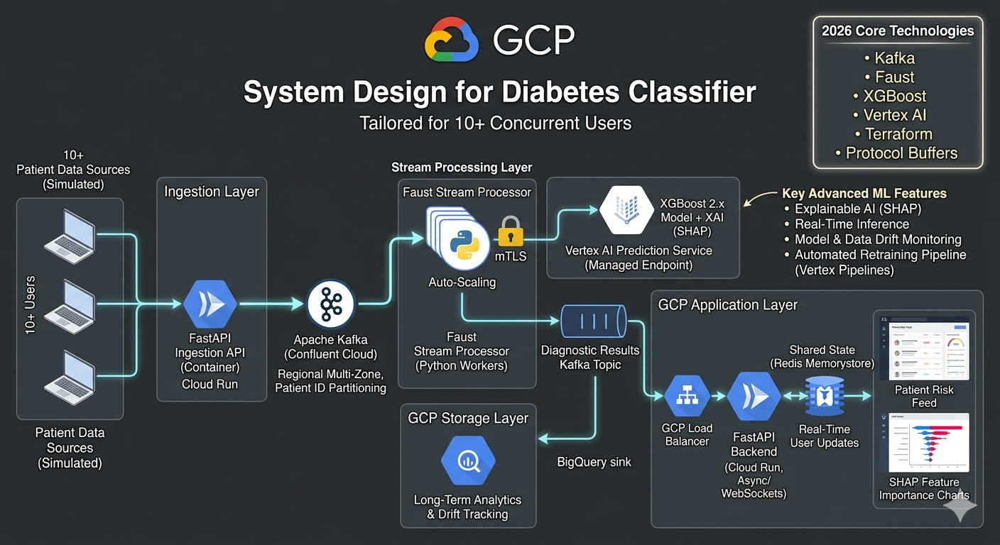

## Data Source

1. Training set- CDC BRFSS
2. Synthea- live stream of data for real time production

## Project Structure

```
Sweet-Sense-AI/
├── infra/ # IaC: Kafka Topics, Vertex Endpoints, BQ Datasets
│ ├── bigquery.tf
│ ├── envs_dev.tfvars
│ ├── envs_prod.tfvars
│ ├── main.tf
│ ├── kafka.tf
│ ├── variables.tf
│ └── vertex.tf
├── data/ # Data exploration & validation
│ ├── schemas/ # Protobuf or Avro definitions for Kafka messages
│ │ └── patient_event.proto
│ └── notebooks/ # Initial XGBoost training & SHAP analysis
├── model/ # Model training & serialization
│ ├── train.py # Script to train and upload model to Vertex AI
│ ├── explanation_parameters.json
│ └── explanation_metadata.json
├── stream_processor/ # Faust / Kafka Streams logic
│ ├── app.py # Main streaming worker
│ ├── feature_eng.py # Real-time feature calculation
│ └── Dockerfile
├── services/
│ ├── backend/ # FastAPI: Serves UI & connects to Kafka
│ │ ├── api/
│ │ ├── core/ # Kafka Consumer logic
│ │ └── main.py
│ └── frontend/ # React + TypeScript Dashboard
│ │ ├── src/
│ │ | ├── components/ # SHAP Chart, Risk Feed, Patient Card
│ │ │ └── hooks/ # useWebSocket for live data
├── simulator/ # Script to simulate 10+ concurrent users/patients
│ └── producer.py # Produces data to Kafka
├── .github/
│ ├── workflows/ # CI/CD for Docker builds and Terraform
│ │ ├── ci.yml
│ │ └── deployment.yml
├── .gitignore
├── docker-compose.yml # For local development (Kafka + Zookeeper)
└── README.md # Architecture diagrams and setup instructions
```
